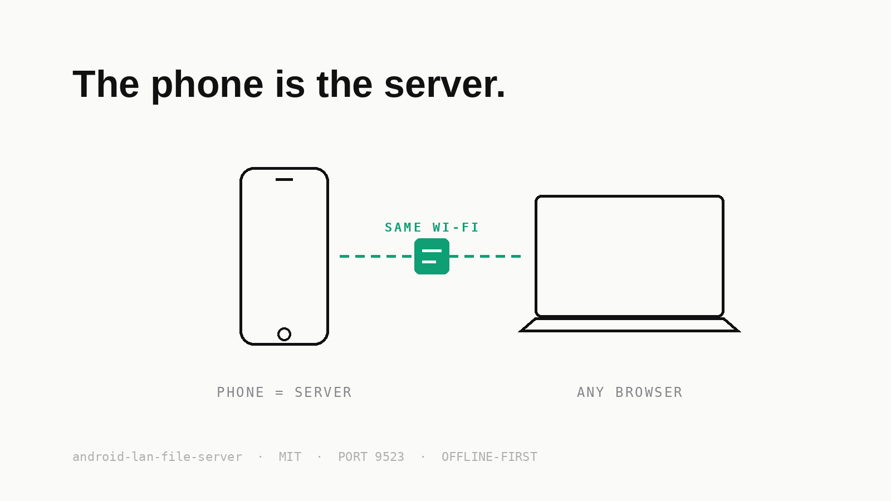
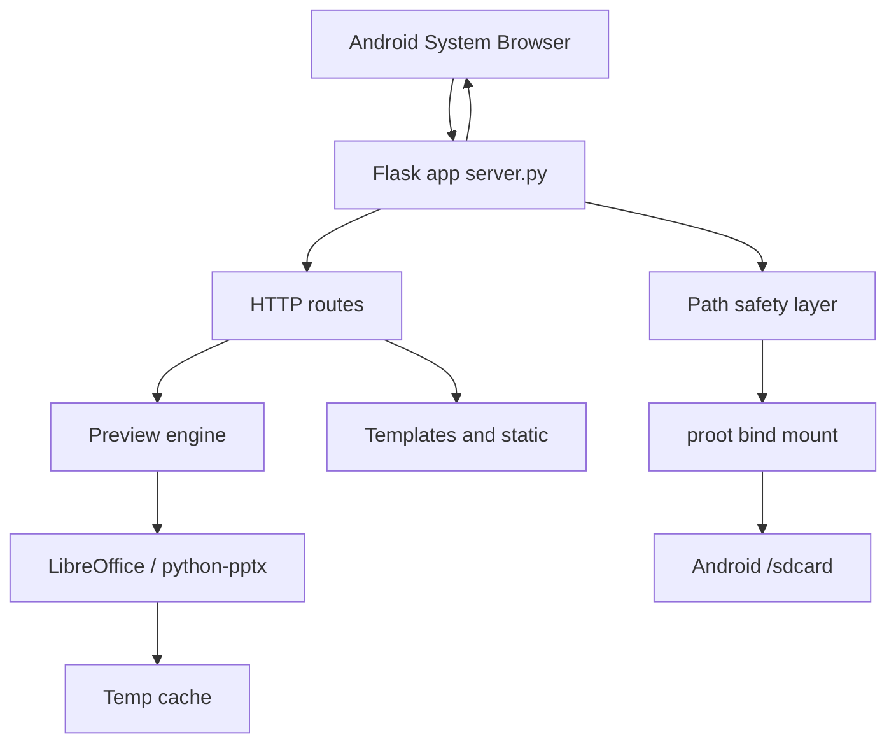
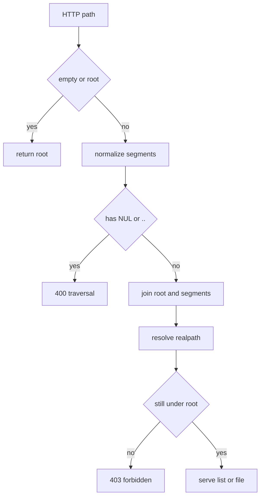
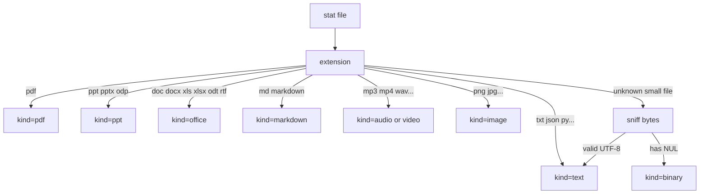
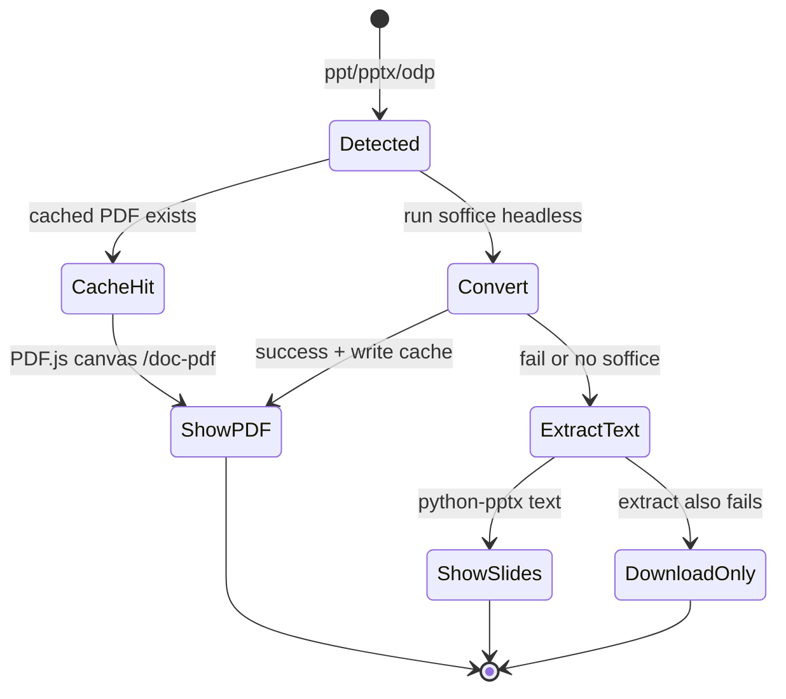
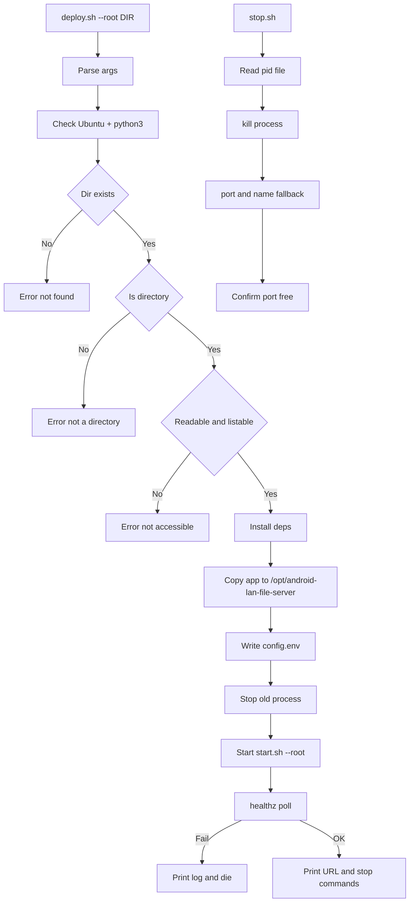
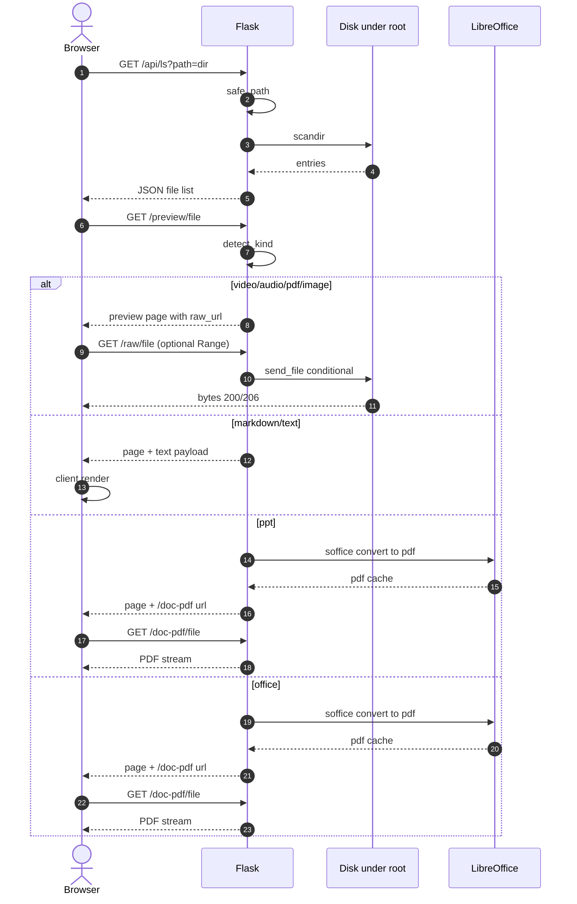

# android-lan-file-server

**English | [简体中文](README.md)**

A **LAN file server** running on an **Android phone (Termux Ubuntu subsystem)**: the phone is the server — computers, tablets, and other phones on the same Wi-Fi open an address in a browser to browse and preview the directory you share: photos, videos, PDFs, Word, Excel, PPT, and Markdown viewable online. **No public network, no accounts, files never leave the LAN.**

<p align="center">
  
</p>

| Item | Description |
|------|------|
| Runtime | Termux + Ubuntu subsystem (not native Termux bash) |
| Stack | Python 3 + Flask; frontend HTML/CSS/JS (embedded Markdown rendering) |
| Default listen | `0.0.0.0:9523` (phone + LAN; `127.0.0.1` for phone only) |
| Browse root | `/sdcard` by default; **any readable directory can be specified** |
| Data plane | Reads Android paths already bind-mounted into proot |
| Auth | None (devices on the same network can access whatever you expose; do not expose the service to untrusted networks) |
| Local private config | `android-lan-file-server.local.conf` (**gitignored, never committed**; you must create it yourself after switching machines — see 4.1) |

> **Note (must read after cloning onto a new machine)**: machine-specific settings (e.g. the default directory `DEFAULT_ROOT`) live in `android-lan-file-server.local.conf`.
> That file is gitignored and **is not cloned to the new machine with the repository**. Create it before starting on a new machine, or you will only get the generic template defaults:
>
> ```bash
> # Three lines; details in section 4.1 "Local private config"
> echo "DEFAULT_ROOT=/sdcard/your-directory" > android-lan-file-server.local.conf
> ```
>
> The startup banner shows whether the "local private config" was loaded, and reminds you if it has not been created.

---

## Use cases

- **Sharing is just the LAN**: friends/colleagues on the same Wi-Fi open your phone's address in a browser and browse the directory you exposed — no WeChat file transfers, no cloud-drive upload/download round trip
- **Phone files, big screen**: photos, videos, and work documents (Word/Excel/PPT) preview and download directly in a desktop browser, with seek and in-page turning
- **Meeting-room sharing**: expose a materials directory; every device in the room scans the address and grabs what it needs; stop it when the meeting ends
- **Purely local, nothing leaves**: the service listens only on the LAN; files never pass through any public server or third-party account, so sensitive material can be shared with confidence
- **Phone as a lightweight NAS**: run persistently in the background (`ANDROID_LAN_DAEMON=yes`) so devices at home/dorm can reach the phone's data disk any time

---

## 1. Features

### 1.1 File browsing
- Directory tree / breadcrumbs / parent directory
- Chinese and space-containing paths
- Filenames **wrap in full** (no ellipsis truncation); previewability is expressed by the button on the right (a "Preview" button appears only when preview is available)
- Mobile card layout in two rows: the name takes the full first row, `size · time` and action buttons on the second
- Every row and the preview page support **one-click copy of the server's full path**, handy for pasting straight into a terminal
- Optional display of hidden files (names starting with `.`)
- Name filter for the current directory
- Returning from a preview to the list **auto-focuses the file you were just viewing**
- Very large directories are truncated (about 5000 entries max by default)

### 1.2 Online preview (in the browser, no forced download)

| Type | Extensions (examples) | Preview method |
|------|----------------|----------|
| PDF | `.pdf` | Bundled PDF.js renders to canvas (works in WeChat/QQ in-app browsers, iOS, and other iframe white-screen cases) |
| PPT/PPTX | `.ppt` `.pptx` `.pps` `.ppsx` `.odp` | Prefer LibreOffice → PDF for embedded preview; fall back to extracting slide text; otherwise download only |
| Word/Excel | `.doc` `.docx` `.odt` `.rtf` `.xls` `.xlsx` `.ods` | LibreOffice (writer/calc components) converts to PDF paginated by the document layout / A4 for embedded preview; if not installed or conversion fails, download is offered |
| Markdown | `.md` `.markdown` … | Server returns the raw text; `md.js` renders client-side (can switch to source) |
| Plain text | `.txt` `.log` `.json` `.yml` `.py` … | Line numbers / wrap toggle, font-size zoom (no wrapping by default); `.json` auto-formatted, can switch back to source |
| Audio | `.mp3` `.m4a` `.wav` `.flac` `.ogg` … | HTML5 `<audio>` with Range seeking |
| Video | `.mp4` `.webm` `.mkv` `.mov` … | HTML5 `<video>` with Range seeking |
| Images | `.jpg` `.png` `.gif` `.webp` … | `` built-in preview |
| EPUB | `.epub` | Full rendering not supported yet; download offered |
| Others | — | Download / raw file link |

Every file type also offers **Preview** / **Download** / **Raw link**.

Previewable files in the same directory can be switched by **swiping left/right** on the preview page: swipe left for the next file, right for the previous one, stopping at the first/last file (**no wrap-around**; swiping further shows an "already at the first/last file" toast); gestures used for horizontal text scrolling, video seeking, or text selection are unaffected.

The `⋮` menu in the preview top bar offers **copy path / download / raw file**; **long-pressing or double-clicking the file name** opens the same menu. Plain text files provide a "Preview / Raw file" view switcher and Markdown provides "Render / Source / Raw file" tabs — the raw file is viewed in place without leaving the page.

### 1.3 Service characteristics
- Listens on `0.0.0.0` by default, **reachable from both the phone and the LAN**; changing it back to `127.0.0.1` restricts access to the phone itself
- On startup, prints both the **loopback URL and the phone's LAN IPv4 address**
- The startup banner automatically shows a **LAN access QR code**: the other side joins the same Wi-Fi, scans, and opens the page — no typing the address (requires `qrencode`, installed automatically by `deploy.sh`)
- Path traversal protection (`..` and illegal paths are rejected)
- Range requests for media files (seeking in video/audio)
- Health check `/healthz`
- Text reading experience: line numbers, wrap toggle, font-size zoom (no wrapping by default), auto-formatted JSON with a source toggle
- PDF/Office/PPT previews use the bundled PDF.js: **WeChat, QQ in-app browsers, iOS, and anywhere else an iframe cannot display a PDF all work**; on failure it degrades automatically to "open in a new window / download"
- When a directory is inaccessible: **deploy/start fails with a clear error** instead of silently succeeding

---

## 2. Quick start

### 2.0 Get the code and environment requirements

```bash
# Gitee
git clone https://gitee.com/cuncaojin/android-lan-file-server.git
# or GitHub
git clone https://github.com/cuncaojin/android-lan-file-server.git
cd android-lan-file-server
```

Requirements:

| Dependency | Required | Notes |
|------|--------|------|
| Termux + Ubuntu subsystem (proot-distro) | Recommended | Primary runtime for this project; any Linux with apt may also work |
| Python 3 + Flask | Required | Installed automatically by `deploy.sh` |
| LibreOffice (impress/writer/calc) | Optional | Without it, PPT/Word/Excel can only be downloaded, not previewed online; `deploy.sh` installs it |
| Chinese fonts `fonts-noto-cjk` | Optional | Keeps converted Chinese documents looking right; `deploy.sh` installs it |
| `qrencode` | Optional | Shows the LAN QR code in the startup banner; `deploy.sh` installs it |

Once installed, continue below: for local development just run `bash start.sh`; for a full deploy see 2.1.

### 2.1 One-command deploy (default `/sdcard`)

```bash
cd android-lan-file-server
bash deploy.sh
```

### 2.2 Deploy to a specific directory / re-specify the root

```bash
# Positional argument
bash deploy.sh /sdcard/Download
bash deploy.sh /sdcard/Download

# Explicit argument
bash deploy.sh --root /sdcard/Download
bash deploy.sh --root /sdcard --port 9523

# Allow paths outside the root (default no)
bash deploy.sh --root /sdcard/Download --allow-outside

# Environment variable
ANDROID_LAN_ROOT=/sdcard/Download bash deploy.sh
```

### 2.3 Printed access URLs on startup (phone + LAN)

After a successful start, `start.sh` / `deploy.sh` print both:

```text
访问链接（手机本机）:
  → http://127.0.0.1:9523/
访问链接（局域网他人可打开）:
  → http://<本机IP>:9523/
```

The service log header contains the same:

```text
[android-lan-file-server] access_url_loopback=http://127.0.0.1:9523/
[android-lan-file-server] access_url_lan:
[android-lan-file-server]   http://<本机IP>:9523/
```

> `<本机IP>` is the phone's LAN address auto-detected at startup; see the startup output for the actual value (no concrete IP is written in this document).
>
> For the LAN to be reachable, `ANDROID_LAN_HOST` must be `0.0.0.0` (the config file default).
> If it is set to `127.0.0.1`, nobody else can connect even when the LAN IP is printed.

### 2.4 Start with a directory from the command line

```bash
# Specify a directory for this run (example: share)
bash /opt/android-lan-file-server/start.sh --root /sdcard/Download

# Also allow access outside the root
bash /opt/android-lan-file-server/start.sh --root /sdcard/Download --allow-outside
```

Open on the phone itself:

```
http://127.0.0.1:9523/
```

Open from other devices on the LAN (use the IP printed in the startup log):

```
http://<本机IP>:9523/
```

If a firewall/system blocks it, allow TCP `9523`.

### 2.5 How to set the default startup directory

Edit the standalone config file `/opt/android-lan-file-server/android-lan-file-server.conf`:

```bash
DEFAULT_ROOT=/sdcard/Download
ALLOW_OUTSIDE_ROOT=no
ANDROID_LAN_HOST=0.0.0.0
ANDROID_LAN_PORT=9523
ANDROID_LAN_DAEMON=no
```

Save, then restart:

```bash
bash /opt/android-lan-file-server/stop.sh
bash /opt/android-lan-file-server/start.sh
```

> If you want the repository's `android-lan-file-server.conf` to stay a generic template while keeping a personal default directory only on this machine, use the local private config `android-lan-file-server.local.conf` instead (never committed) — see 4.1.

The command-line `--root` only overrides the config file **for that run**; it never rewrites the config.

### 2.6 When a directory is inaccessible

Both the scripts and the service **fail with a clear error and exit**, e.g.:

```text
[deploy][error] 目录不存在：/sdcard/not-exist
[start] 错误: 根目录不可读: /sdcard/xxx
[android-lan-file-server] 错误: 无法列出目录 /sdcard/xxx: Permission denied
```

Just pick a directory you know exists and is accessible, and deploy again.

---

## 3. Directory layout

```text
android-lan-file-server/
├── deploy.sh          # one-command deploy (mount checks, deps, start)
├── stop.sh            # stop the service
├── start.sh           # start (prints access URLs; --root / --allow-outside)
├── server.py          # Flask backend
├── android-lan-file-server.conf    # standalone config: default dir + outside-root switch
├── requirements.txt   # Python dependency notes
├── README.md          # this document (Chinese)
├── README.en.md       # English README
├── templates/         # index / preview / error pages
├── static/            # app.js / md.js / preview.js / css
└── docs/
    ├── diagrams/      # UML Mermaid sources
    └── img/           # optional exported images
```

After installation the service directory is:

```text
/opt/android-lan-file-server/
├── server.py
├── android-lan-file-server.conf    # main config: DEFAULT_ROOT / ALLOW_OUTSIDE_ROOT
├── templates/
├── static/
├── config.env         # legacy env-var compatibility
├── start.sh           # start
└── stop.sh            # stop
```

Runtime files:

| Path | Purpose |
|------|------|
| `/tmp/android-lan-file-server.pid` | Process PID |
| `logs/android-lan-file-server.log` | Service log (under the project root `logs/`, gitignored; written in daemon mode) |
| `android-lan-file-server.local.conf` | Local private config (optional, gitignored, never committed — see 4.1) |
| `/tmp/android-lan-file-server-cache` | PPT→PDF conversion cache |

---

## 4. Configuration

### 4.1 Standalone config file `android-lan-file-server.conf`

**Path:** `/opt/android-lan-file-server/android-lan-file-server.conf`
(the same-named file in the source tree is copied there at deploy time)

```bash
# Default browse root
DEFAULT_ROOT=/sdcard/Download

# Whether paths/files outside DEFAULT_ROOT may be accessed
#   no  = default, strictly limited to DEFAULT_ROOT and its subdirectories
#   yes = absolute paths outside the root are allowed (as long as the process can read them)
ALLOW_OUTSIDE_ROOT=no

ANDROID_LAN_HOST=127.0.0.1
ANDROID_LAN_PORT=9523
ANDROID_LAN_HOME=/opt/android-lan-file-server
ANDROID_LAN_CACHE=/tmp/android-lan-file-server-cache

# Whether to run persistently in the background
#   no  = default, the service follows the current terminal and stops when it closes
#   yes = background daemon, still reachable after the terminal closes
ANDROID_LAN_DAEMON=no
```

Precedence: **command-line arguments > environment variables > config file > built-in defaults**.

| Setting | Env var | CLI flag | Default | Notes |
|--------|----------|--------|------|------|
| `DEFAULT_ROOT` | `ANDROID_LAN_ROOT` | `--root` | `/sdcard` | Default browse root |
| `ALLOW_OUTSIDE_ROOT` | `ANDROID_LAN_ALLOW_OUTSIDE_ROOT` | `--allow-outside` / `--deny-outside` | `no` | Whether access outside the root is allowed |
| `ANDROID_LAN_HOST` | `ANDROID_LAN_HOST` | `--host` | `0.0.0.0` | Listen address (`0.0.0.0` includes the LAN) |
| `ANDROID_LAN_PORT` | `ANDROID_LAN_PORT` | `--port` | `9523` | Listen port |
| `ANDROID_LAN_DAEMON` | `ANDROID_LAN_DAEMON` | — | `no` | Background switch: `yes`=still reachable after closing the terminal (log goes to `logs/android-lan-file-server.log`); `no`=follows the current terminal |
| `ANDROID_LAN_CACHE` | `ANDROID_LAN_CACHE` | — | `/tmp/android-lan-file-server-cache` | PPT conversion cache |
| — | `ANDROID_LAN_CONF` | `--conf` | auto-discovered | Config file path |
| — | `ANDROID_LAN_LOCAL_CONF` | — | auto-discovered | Local private config path (defaults to `android-lan-file-server.local.conf` in the same directory) |
| — | `ANDROID_LAN_MAX_TEXT` | — | `2097152` | Max bytes for text preview |
| — | `ANDROID_LAN_MAX_LIST` | — | `5000` | Max directory listing entries |

#### Local private config `android-lan-file-server.local.conf` (never committed)

The repository's `android-lan-file-server.conf` is a **generic template** (no personal paths). If you want this machine to keep its own default directory without committing/sharing it, put the personalized settings in `android-lan-file-server.local.conf` in the same directory:

```bash
# Local private config (added to .gitignore, never committed)
DEFAULT_ROOT=/sdcard/your-directory/share
```

- Precedence: **command-line arguments > `android-lan-file-server.local.conf` > `android-lan-file-server.conf` > built-in defaults**
- Both `start.sh` and `server.py` read it automatically; the path can be set with `ANDROID_LAN_LOCAL_CONF`
- Sharing the repository needs (and will not include) this file; `deploy.sh` copies it automatically when deploying to this machine

### 4.2 Path permission switch (important)

| Mode | Config | Behavior |
|------|------|------|
| **Default strict mode** | `ALLOW_OUTSIDE_ROOT=no` | Only `DEFAULT_ROOT` **and its subdirectories**; `..` and out-of-bounds absolute paths are always rejected (403/400) |
| **Outside-root allowed** | `ALLOW_OUTSIDE_ROOT=yes` or `--allow-outside` at startup | Besides the root tree, other absolute paths readable by the process may be accessed |

With outside access disabled, any request resolving outside `DEFAULT_ROOT` is rejected.
With it enabled, files outside the root can be addressed as `@/absolute/path`, e.g. `/raw/@/sdcard/Download/file.pdf`.

### 4.3 Running `server.py` directly

```bash
cd /opt/android-lan-file-server
python3 server.py \
  --root /sdcard/Download \
  --host 127.0.0.1 \
  --port 9523 \
  --deny-outside
```

If the directory does not exist / is unreadable, the process exits non-zero and prints an error.

### 4.4 Changing a deployed config

```bash
# Method A: edit the config file, then restart (recommended)
vi /opt/android-lan-file-server/android-lan-file-server.conf
bash /opt/android-lan-file-server/stop.sh
bash /opt/android-lan-file-server/start.sh

# Method B: override on the command line for this run
bash /opt/android-lan-file-server/stop.sh
bash /opt/android-lan-file-server/start.sh --root /sdcard/Download --allow-outside

# Method C: re-deploy to write the config
bash ./deploy.sh \
  --root /sdcard/Download --allow-outside
```

---

## 5. Start / stop / restart / status

### 5.1 Deploy

```bash
bash ./deploy.sh --root /sdcard/Download
```

Deploy steps:
1. Detect Ubuntu + `python3`
2. **Verify the specified directory exists, is a directory, is readable, and listable** (fail with an error otherwise)
3. Install Flask, python-pptx, LibreOffice components (impress/writer/calc), Chinese fonts fonts-noto-cjk, and qrencode (all optional)
4. Sync the app to `/opt/android-lan-file-server` and write `android-lan-file-server.conf`
5. Stop any old process and start via `start.sh`
6. Poll `/healthz`; on success print the access URL and the stop command

### 5.2 Start

```bash
# Use the default directory from the config file
bash /opt/android-lan-file-server/start.sh

# Specify a directory on the command line (example: share)
bash /opt/android-lan-file-server/start.sh --root /sdcard/Download

# Specify a directory + allow access to other paths
bash /opt/android-lan-file-server/start.sh --root /sdcard/Download --allow-outside
```

Startup prints the access URLs (the banner text is emitted by the scripts in Chinese):

```text
============================================================
 android-lan-file-server 启动中
------------------------------------------------------------
 浏览根目录   : /sdcard/Download
 越权访问     : no（默认，仅限根目录及其子目录）
 监听地址     : http://0.0.0.0:9523/  (bind=0.0.0.0)
------------------------------------------------------------
 访问链接（手机本机）:
   → http://127.0.0.1:9523/
 访问链接（局域网他人可打开）:
   → http://<本机IP>:9523/
------------------------------------------------------------
 配置文件     : /opt/android-lan-file-server/android-lan-file-server.conf
 本地私有配置 : 未创建 —— 换机器后如需本机专属默认值（如个人目录），
                请新建 /opt/android-lan-file-server/android-lan-file-server.local.conf（gitignore 不入库，见 README 4.1）
 运行模式     : 前台（跟随当前终端，关闭终端即停止）
 日志         : 前台输出（当前终端，无日志文件）
 PID          : /tmp/android-lan-file-server.pid
 停止命令     : bash /opt/android-lan-file-server/stop.sh
============================================================
```

> In a terminal, the access URLs are styled **bold cyan + arrow** (colors are stripped automatically when redirected to a log);
> the "local private config" line shows the load status of `android-lan-file-server.local.conf`.

### 5.3 Stop

```bash
bash /opt/android-lan-file-server/stop.sh
bash ./stop.sh
kill $(cat /tmp/android-lan-file-server.pid)
```

### 5.4 Restart

```bash
bash /opt/android-lan-file-server/stop.sh && bash /opt/android-lan-file-server/start.sh --root /sdcard/Download
```

### 5.5 Status / logs

```bash
cat /tmp/android-lan-file-server.pid
ps -p $(cat /tmp/android-lan-file-server.pid) -o pid,cmd
tail -f logs/android-lan-file-server.log      # run from the project/install directory
curl -s http://127.0.0.1:9523/healthz
```

> The log lives at `logs/android-lan-file-server.log` in the project root and is only written when `ANDROID_LAN_DAEMON=yes` (background daemon); in foreground mode logs go to the starting terminal.

Example `/healthz` response:

```json
{
  "ok": true,
  "root": "/sdcard/Download",
  "root_readable": true,
  "allow_outside_root": false,
  "conf": "/opt/android-lan-file-server/android-lan-file-server.conf",
  "soffice": true,
  "version": "1.1.0"
}
```

---

## 6. Main HTTP endpoints

| Method | Path | Description |
|------|------|------|
| GET | `/` | File browsing page |
| GET | `/api/ls?path=<rel>&hidden=0|1` | Directory listing as JSON |
| GET | `/preview/<rel>` | Preview page (supports `?kind=` `?download=1`) |
| GET | `/raw/<rel>` | Raw file (supports Range) |
| GET | `/doc-pdf/<rel>` | PDF converted from PPT/Word/Excel |
| GET | `/api/kind/<rel>` | Query a file's kind |
| GET | `/healthz` | Health check |
| GET | `/static/*` | Frontend static assets |

All paths are relative to `ANDROID_LAN_ROOT`; anything outside the root returns `403/400`.

---

## 7. How it works (details)

### 7.1 Overall architecture

The service runs inside the Ubuntu subsystem. Android storage is bind-mounted by proot into paths visible to Ubuntu (commonly `/sdcard`, `/storage/emulated/0`). The web service only reads files under that root and does all browsing and previewing over HTTP in the browser.

```text
┌──────────────── Android phone ────────────────┐
│  System browser                               │
│      │  http://127.0.0.1:9523                 │
│      ▼                                        │
│  Termux Ubuntu proot-distro                   │
│      ┌─────────────────────────────────────┐  │
│      │  android-lan-file-server (Flask, server.py)      │  │
│      │   · HTTP routes / templates / statics│  │
│      │   · Path safety layer safe_path()    │  │
│      │   · Preview engine detect_kind()     │  │
│      │   · PPT conversion (LibreOffice/pptx)│  │
│      └───────────────┬─────────────────────┘  │
│                      │ bind-mount / read files │
│                      ▼                        │
│            /sdcard/... Android storage        │
└────────────────────────────────────────────────┘
```



### 7.2 Runtime components

| Component | Location | Responsibility |
|------|------|------|
| Flask app | `server.py` | HTTP service, routes, error handling |
| Path safety | `safe_path()` | Resolves relative paths inside the root, rejects traversal |
| Preview classification | `detect_kind()` | Decides pdf, ppt, office, md, text, audio… by extension/sniffing |
| File sending | `send_file(conditional=True)` | Normal file streaming + HTTP Range (media seeking) |
| Office conversion | `convert_to_pdf()` | `soffice --headless --convert-to pdf` (shared by PPT/Word/Excel) |
| PDF rendering | `static/vendor/pdfjs*.mjs` | PDF.js 6.x (Apache-2.0, vendored in the repo, ~1.8MB); canvas rendering compatible with WeChat/iOS |
| PPT text | `extract_ppt_text()` | Slide text extraction via python-pptx |
| Frontend listing | `static/app.js` | Fetches `/api/ls`, renders directories/files/action buttons |
| Markdown | `static/md.js` | Safe client-side rendering (escape first, then wrap tags) |
| Deploy orchestration | `deploy.sh` | Verify directory → install deps → sync files → start → health check |
| Process management | `start.sh` / `stop.sh` | PID file + port-based fallback cleanup |

### 7.3 Request pipeline

1. Browser opens `/` or `/?path=<dir>`
2. After the page loads, `app.js` calls `GET /api/ls?path=...`
3. Server validates the path with `safe_path()` → lists with `os.scandir()` → returns JSON
4. User clicks a file → `/preview/<path>`
5. `detect_kind()` classifies:
   - **pdf/audio/video/image**: the preview page embeds `raw_url`, and the browser renders/plays directly
   - **markdown/text**: content is read (truncated if huge) and handed to the page
   - **ppt**: goes down the convert/extract branches
6. While media plays, the browser requests `/raw/<path>`; the server supports `Range` and answers `200` or `206`

### 7.4 Path safety model

Goal: **access must stay inside `ANDROID_LAN_ROOT`**.

```text
input rel
  → normalize (backslashes, empty segments)
  → reject NUL / ".."
  → join(ANDROID_LAN_ROOT, rel)
  → Path.resolve() symlinks and real path
  → assert result still under the root prefix
  → else 403/400
```



So even a request for `../` or `/sdcard/../etc` can never read files outside the root.

### 7.5 Preview kind detection



### 7.6 PPT online preview strategy

PPT/PPTX **cannot** be opened natively and reliably by browsers the way PDF can, so a degradation chain is used:



Word/Excel (`kind=office`) go through the same soffice → PDF chain (reusing the cache) but have **no** text-extraction fallback: if conversion fails or LibreOffice is not installed, download is offered directly. Export paginates by the document's own layout / A4 printing (matching Office's print preview). Before converting `.xlsx`, headers/footers are explicitly cleared on a temporary copy — otherwise LibreOffice's default page style prints the **sheet name into the header and the page number into the footer** (visible in the preview as orphan characters at the top of each page and "Page 1"). Chinese rendering depends on system CJK fonts; `deploy.sh` installs `fonts-noto-cjk` automatically (install it yourself on a manual deploy, or Chinese may fall back to an old font or tofu boxes). Note: `.xls` (binary format) cannot get the same preprocessing and may still show header/footer decorations.

Key points:
- LibreOffice headless conversion is slow; results are cached in `ANDROID_LAN_CACHE` keyed by "filename+mtime+size"
- A failed conversion never blocks the service; text extraction is attempted automatically
- If both fail, the UI offers download instead of pretending the "preview succeeded"

### 7.7 Deploy and directory mount strategy

```text
deploy.sh
  ├─ parse --root/--host/--port
  ├─ ensure_root_mounted
  │    ├─ missing → error and exit
  │    ├─ not a directory → error and exit
  │    ├─ unreadable / not listable → error and exit (with an Android permission hint)
  │    └─ ok → record the absolute path and a sample file
  ├─ install_deps
  ├─ deploy_app → /opt/android-lan-file-server + config.env + start.sh/stop.sh
  └─ start_service → healthz poll; on failure print the log and exit
```

Design principles:
- **Never blindly mkdir** an "expected" directory the user did not confirm, so a wrong path can never be mistaken for a successful mount
- Only when the default `/sdcard` is unreadable does it attempt bind-mounting common storage paths
- For a directory the user says "I can access": if readable, start; if not, **fail loudly** instead of pretending



### 7.8 Preview sequence (core)



### 7.9 Security and limits

| Mechanism | Behavior |
|------|------|
| Default listen | `0.0.0.0`, reachable from phone + LAN (do not map it to the public internet) |
| Auth | None (scope limited by your `DEFAULT_ROOT` + `ALLOW_OUTSIDE_ROOT`) |
| Path traversal | `..`/illegal paths rejected |
| Outside-root off by default | With `ALLOW_OUTSIDE_ROOT=no`, only the root and its subdirectories are allowed |
| Text preview | Truncated past `ANDROID_LAN_MAX_TEXT` |
| Large directories | Truncated past `ANDROID_LAN_MAX_LIST` |
| Caching | Converted PDFs only; sensitive files are never strongly cached in the browser |
| Android protected directories | If unreadable, an error is reported and you pick another path |

> For phone-only use, set `ANDROID_LAN_HOST` back to `127.0.0.1` and restart.
> For LAN sharing, make sure the phone's system firewall does not block `9523` and that the other device is on the same subnet.

### 7.10 UML diagram sources

| Diagram | Source file | Meaning |
|----|--------|------|
| Component/architecture | [`docs/diagrams/architecture.mmd`](docs/diagrams/architecture.mmd) | Browser, Flask, preview engine, storage binding |
| Path safety flowchart | [`docs/diagrams/path-safety.mmd`](docs/diagrams/path-safety.mmd) | How a request path is validated |
| Preview sequence | [`docs/diagrams/preview-sequence.mmd`](docs/diagrams/preview-sequence.mmd) | List/preview/media/PPT message flow |
| PPT state machine | [`docs/diagrams/ppt-preview-state.mmd`](docs/diagrams/ppt-preview-state.mmd) | PDF → text → download-only degradation |
| Deploy flowchart | [`docs/diagrams/deploy-flow.mmd`](docs/diagrams/deploy-flow.mmd) | Deploy and stop lifecycle |

---

## 8. FAQ

### Q1: The page won't open?
1. Confirm the process exists: `ps -p $(cat /tmp/android-lan-file-server.pid)`
2. `curl -s http://127.0.0.1:9523/healthz`
3. Check the log: `tail -f logs/android-lan-file-server.log` (from the project directory; the log file exists only in background daemon mode)

### Q2: The directory listing is empty?
- Confirm the directory pointed to by `config.env` / `start.sh --root` is not empty
- Verify manually: `ls -la /sdcard/your-directory`

### Q3: PPT preview won't open?
- Check whether `soffice` is `true` in `/healthz`
- Without LibreOffice it falls back to text extraction or download-only
- Conversion cache directory: `/tmp/android-lan-file-server-cache`

### Q4: Video/audio seeking doesn't work?
- Confirm the server log has no 500s
- Self-test with a Range request:
  ```bash
  curl -I -H "Range: bytes=0-99" http://127.0.0.1:9523/raw/DCIM/video/test-10s.mp4
  ```
  You should see `206 Partial Content`

### Q5: Chinese paths show mojibake / 404?
- Preview links are built by the frontend with `encodeURIComponent` per path segment
- You can access directly:
  ```text
  http://127.0.0.1:9523/preview/DCIM/video/test-10s.mp4
  ```

### Q6: Changed the directory but the browser still shows the old one?
- Restart the service with the new root:
  ```bash
  bash /opt/android-lan-file-server/stop.sh
  bash /opt/android-lan-file-server/start.sh --root /sdcard/new-directory
  ```

---

## 9. Uninstall / cleanup (optional)

```bash
bash /opt/android-lan-file-server/stop.sh
rm -rf /opt/android-lan-file-server
rm -f /tmp/android-lan-file-server.pid /tmp/android-lan-file-server.log
rm -rf /tmp/android-lan-file-server-cache
```

---

## 10. Example: viewing a 10-second test video

If the directory contains the test file:

```text
http://127.0.0.1:9523/preview/DCIM/video/test-10s.mp4
```

Deploy to that directory:

```bash
bash ./deploy.sh --root /sdcard/DCIM/video
```

---

**Positioning recap**: this is a **LAN file server** deployed inside an Android phone (Termux Ubuntu); any device on the same network can browse and preview the directory you share from a browser; the mount root is configurable; access failures are reported as errors; online preview is centered on PDF.js + LibreOffice conversion.

---

## License

[MIT](LICENSE) © 2026 cuncaojin

Third-party components: frontend PDF rendering uses the vendored [PDF.js](https://mozilla.github.io/pdf.js/) (Apache-2.0, see `static/vendor/PDFJS-LICENSE.txt`).

