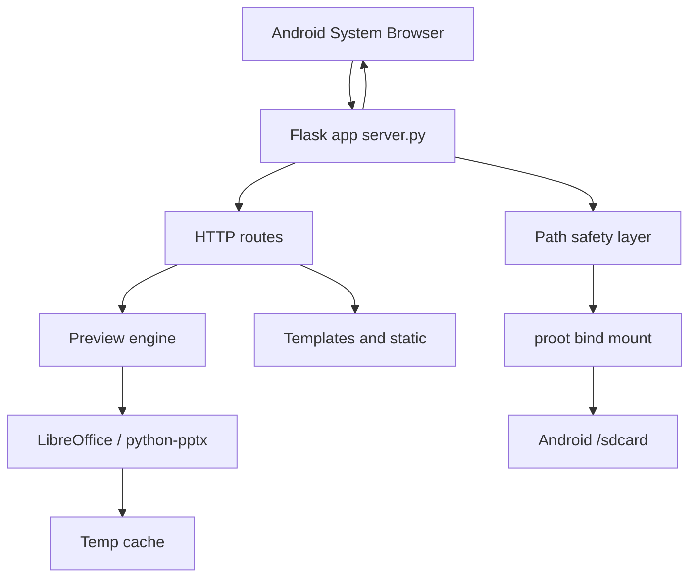
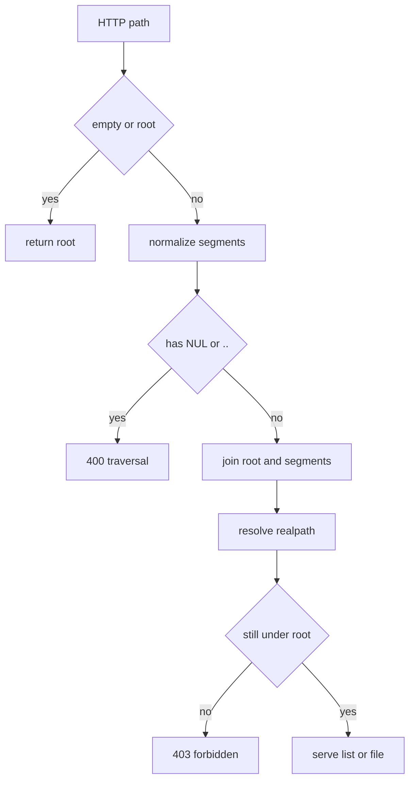
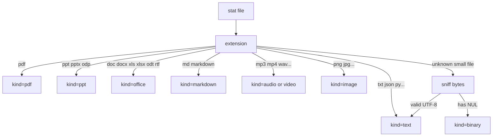
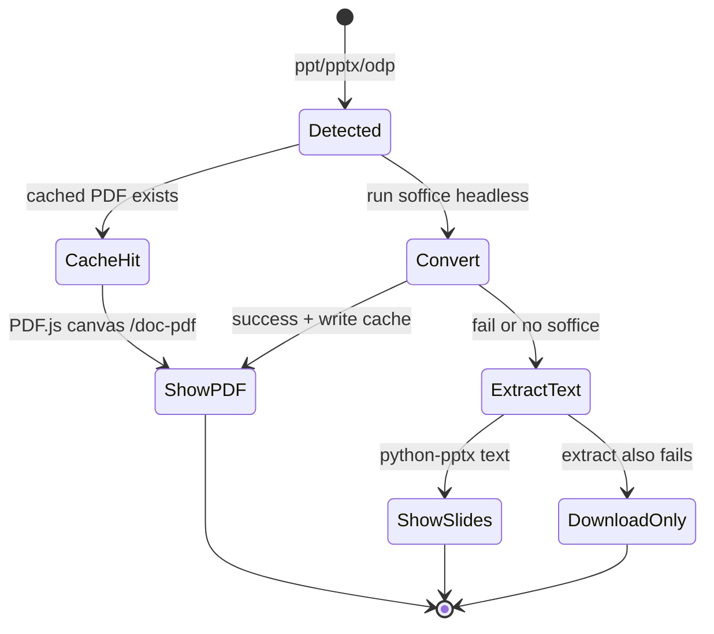
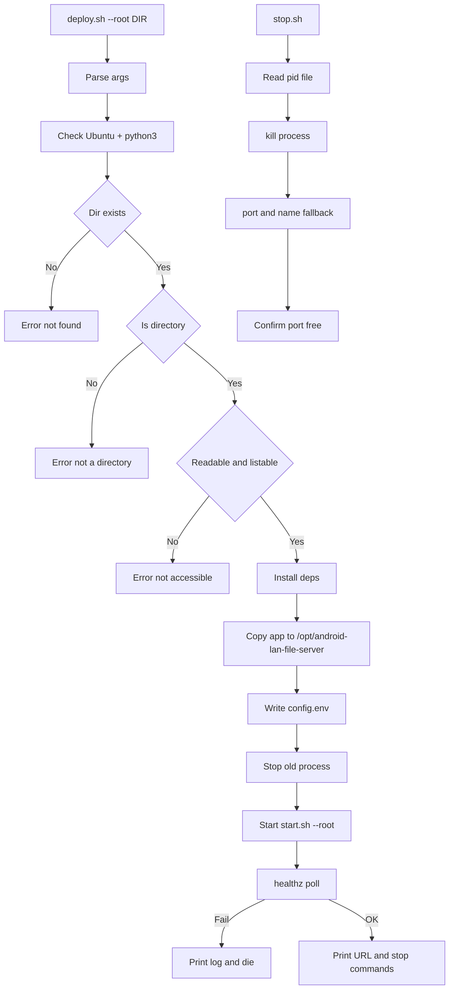
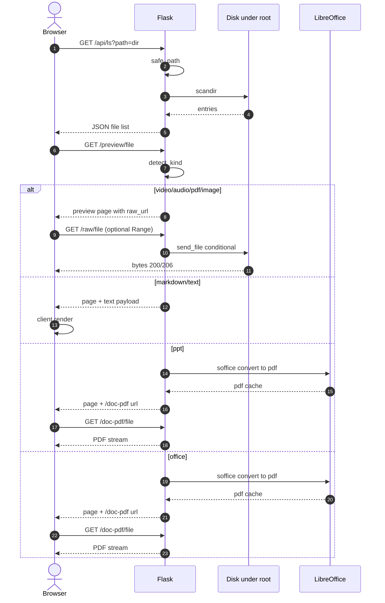

# android-lan-file-server

在 **安卓手机（Termux Ubuntu 子系统）** 上运行的**局域网本地文件服务器**：手机即服务器，同一 Wi-Fi 下的电脑、平板、其他手机用浏览器打开地址即可浏览和预览你分享的目录——照片、视频、PDF、Word、Excel、PPT、Markdown 在线查看。**无需公网、无需账号、文件不出局域网。**

| 项目 | 说明 |
|------|------|
| 运行环境 | Termux + Ubuntu 子系统（非 Termux 原生 bash） |
| 技术栈 | Python 3 + Flask；前端 HTML/CSS/JS（内嵌 Markdown 渲染） |
| 默认监听 | `0.0.0.0:9523`（本机 + 局域网；`127.0.0.1` 仅本机） |
| 浏览根目录 | 默认 `/sdcard`，**可指定任意可读目录** |
| 数据面 | 直接读取 proot 已绑定的安卓路径 |
| 认证 | 无（同网段设备按你放开的目录访问；不要把服务暴露到不可信网络） |
| 本机私有配置 | `android-lan-file-server.local.conf`（**gitignore 不入库**，换机器后需自行创建，见 4.1） |

> **注意（换机器克隆后必读）**：个人专属配置（如默认目录 `DEFAULT_ROOT`）写在 `android-lan-file-server.local.conf` 中，
> 该文件被 gitignore 排除，**不会随仓库一起被克隆到新机器**。新机器上启动前请先创建它，否则只有通用模板默认值：
>
> ```bash
> # 三行即可，详见 4.1 节「本地私有配置」
> echo "DEFAULT_ROOT=/sdcard/你的目录" > android-lan-file-server.local.conf
> ```
>
> 启动时横幅会显示「本地私有配置」的加载状态，未创建时也会提醒。

---

## 使用场景

- **局域网即分享**：朋友/同事与你连同一个 Wi-Fi，浏览器打开你手机的地址就能浏览你放开的目录——不用微信传文件、不用网盘上传再下载
- **手机文件，大屏看**：拍的照片和视频、工作报告（Word/Excel/PPT）在电脑浏览器里直接预览、下载，支持拖动进度、在线翻页
- **会议室临时共享**：把资料目录开出来，在场所有人的设备扫一眼地址、点开即取，散会即停
- **纯本地不外传**：服务只监听局域网，文件不经过任何公网服务器与第三方账号，敏感资料也能放心共享
- **手机当轻量 NAS**：长期跑在后台（`ANDROID_LAN_DAEMON=yes`），家里/宿舍设备随时访问手机里的资料盘

---

## 1. 功能能力

### 1.1 文件浏览
- 目录树 / 面包屑 / 上级目录
- 中文路径、空格路径
- 文件名**换行完整显示**（不截断省略号）；可预览与否由右侧按钮表达（可预览才有「预览」按钮）
- 移动端卡片式两行：名称占整行，`大小 · 时间` 与操作按钮排第二行
- 可选显示隐藏文件（`.` 开头）
- 当前目录名称筛选
- 超大目录会截断列表（默认最多约 5000 条）

### 1.2 在线预览（浏览器内，不强制下载）

| 类型 | 扩展名（示例） | 预览方式 |
|------|----------------|----------|
| PDF | `.pdf` | 内置 PDF.js 渲染到 canvas（微信/QQ 内置浏览器、iOS 等 iframe 白屏场景可正常查看） |
| PPT/PPTX | `.ppt` `.pptx` `.pps` `.ppsx` `.odp` | 优先 LibreOffice 转 PDF 内嵌预览；失败则提取幻灯片文本；再失败仅下载 |
| Word/Excel | `.doc` `.docx` `.odt` `.rtf` `.xls` `.xlsx` `.ods` | LibreOffice（writer/calc 组件）按文档版面/A4 分页转 PDF 内嵌预览；未装或转换失败则提供下载 |
| Markdown | `.md` `.markdown` … | 服务端回传原文，`md.js` 客户端渲染（可切源码） |
| 纯文本 | `.txt` `.log` `.json` `.yml` `.py` … | 行号 / 换行开关、字号缩放（默认不换行）；`.json` 自动格式化，可切回源码 |
| 音频 | `.mp3` `.m4a` `.wav` `.flac` `.ogg` … | HTML5 `<audio>`，支持 Range 拖动进度 |
| 视频 | `.mp4` `.webm` `.mkv` `.mov` … | HTML5 `<video>`，支持 Range 拖动进度 |
| 图片 | `.jpg` `.png` `.gif` `.webp` … | `` 内置预览 |
| EPUB | `.epub` | 暂不支持完整渲染，提供下载 |
| 其它 | — | 提供下载 / 原始文件链接 |

每种文件也提供：**预览** / **下载** / **原始链接**。

### 1.3 服务特性
- 默认监听 `0.0.0.0`，**本机与局域网都可访问**；若改回 `127.0.0.1` 则仅本机
- 启动时同时打印：**回环地址 + 本机局域网 IPv4 地址**
- 路径穿越防护（`..`、非法路径会被拒绝）
- 媒体文件 Range 请求（视频/音频拖动进度）
- 健康检查 `/healthz`
- 文本阅读体验：行号显示、换行开关、字号缩放（默认不换行），JSON 自动格式化可切源码
- PDF/Office/PPT 预览用内置 PDF.js 渲染：**微信、QQ 内置浏览器、iOS 等 iframe 无法显示 PDF 的场景均可正常查看**；失败自动降级为“新窗口打开/下载”
- 目录不可访问时：**部署/启动直接报错**，不静默成功

---

## 2. 快速开始

### 2.0 获取代码与环境要求

```bash
# Gitee
git clone https://gitee.com/cuncaojin/android-lan-file-server.git
# 或 GitHub
git clone https://github.com/cuncaojin/android-lan-file-server.git
cd android-lan-file-server
```

环境要求：

| 依赖 | 必需性 | 说明 |
|------|--------|------|
| Termux + Ubuntu 子系统（proot-distro） | 推荐 | 项目主要运行环境；有 apt 的 Linux 也可尝试 |
| Python 3 + Flask | 必需 | `deploy.sh` 自动安装 |
| LibreOffice（impress/writer/calc） | 可选 | 没有它则 PPT/Word/Excel 仅能下载，无法在线预览；`deploy.sh` 自动补装 |
| 中文字体 `fonts-noto-cjk` | 可选 | 保证转换后的中文文档观感；`deploy.sh` 自动补装 |

装好后继续往下：本机开发直接 `bash start.sh`，完整部署见 2.1。

### 2.1 一键部署（默认 `/sdcard`）

```bash
cd /sdcard/yourname/work/gitee/tmp/android-lan-file-server
bash deploy.sh
```

### 2.2 指定目录部署 / 重新指定根目录

```bash
# 位置参数
bash deploy.sh /sdcard/yourname/work/gitee/share
bash deploy.sh /sdcard/Download

# 显式参数
bash deploy.sh --root /sdcard/yourname/work/gitee/share
bash deploy.sh --root /sdcard --port 9523

# 允许访问根目录以外路径（默认 no）
bash deploy.sh --root /sdcard/yourname/work/gitee/share --allow-outside

# 环境变量
ANDROID_LAN_ROOT=/sdcard/Download bash deploy.sh
```

### 2.3 启动时打印访问链接（本机 + 局域网）

`start.sh` / `deploy.sh` 启动成功后会同时打印：

```text
访问链接（手机本机）:
  → http://127.0.0.1:9523/
访问链接（局域网他人可打开）:
  → http://<本机IP>:9523/
```

服务日志开头同样有：

```text
[android-lan-file-server] access_url_loopback=http://127.0.0.1:9523/
[android-lan-file-server] access_url_lan:
[android-lan-file-server]   http://<本机IP>:9523/
```

> `<本机IP>` 为启动时自动检测的本机局域网地址，具体数值以启动输出为准（本文不写具体 IP）。
>
> 局域网要能连上，`ANDROID_LAN_HOST` 必须是 `0.0.0.0`（配置文件默认值）。  
> 若配成 `127.0.0.1`，即使打印了局域网 IP，别人也连不上。

### 2.4 命令行启动指定目录

```bash
# 临时指定目录（例：share）
bash /opt/android-lan-file-server/start.sh --root /sdcard/yourname/work/gitee/share

# 同时允许访问根目录以外
bash /opt/android-lan-file-server/start.sh --root /sdcard/yourname/work/gitee/share --allow-outside
```

手机本机打开：

```
http://127.0.0.1:9523/
```

局域网其他设备打开（用启动日志里打印的 IP）：

```
http://<本机IP>:9523/
```

若防火墙/系统拦截，请放行 TCP `9523`。

### 2.5 如何设置默认启动目录

编辑独立配置文件 `/opt/android-lan-file-server/android-lan-file-server.conf`：

```bash
DEFAULT_ROOT=/sdcard/yourname/work/gitee/share
ALLOW_OUTSIDE_ROOT=no
ANDROID_LAN_HOST=0.0.0.0
ANDROID_LAN_PORT=9523
ANDROID_LAN_DAEMON=no
```

保存后重启：

```bash
bash /opt/android-lan-file-server/stop.sh
bash /opt/android-lan-file-server/start.sh
```

> 若希望仓库里的 `android-lan-file-server.conf` 保持通用模板、仅本机使用个人默认目录，改用本地私有配置 `android-lan-file-server.local.conf`（不入库），见 4.1。

命令行 `--root` 只**临时**覆盖配置文件，不会改写配置。

### 2.6 目录无法访问时

脚本与服务都会 **明确报错并退出**，例如：

```text
[deploy][error] 目录不存在：/sdcard/not-exist
[start] 错误: 根目录不可读: /sdcard/xxx
[android-lan-file-server] 错误: 无法列出目录 /sdcard/xxx: Permission denied
```

你只需要换一个你确保存在且可访问的目录再部署即可。

---

## 3. 目录说明

```text
android-lan-file-server/
├── deploy.sh          # 一键部署（挂载校验、依赖、启动）
├── stop.sh            # 停止服务
├── start.sh           # 启动（打印访问链接；--root / --allow-outside）
├── server.py          # Flask 服务端
├── android-lan-file-server.conf    # 独立配置：默认目录 + 越权访问开关
├── requirements.txt   # Python 依赖说明
├── README.md          # 本文档
├── templates/         # index / preview / error 页面
├── static/            # app.js / md.js / preview.js / css
└── docs/
    ├── diagrams/      # UML Mermaid 源文件
    └── img/           # 可选导出图
```

安装后服务目录默认：

```text
/opt/android-lan-file-server/
├── server.py
├── android-lan-file-server.conf    # 主配置：DEFAULT_ROOT / ALLOW_OUTSIDE_ROOT
├── templates/
├── static/
├── config.env         # 兼容旧版环境变量
├── start.sh           # 启动
└── stop.sh            # 停止
```

运行期文件：

| 路径 | 作用 |
|------|------|
| `/tmp/android-lan-file-server.pid` | 进程 PID |
| `logs/android-lan-file-server.log` | 服务日志（工程根目录 `logs/` 下，已 gitignore；后台常驻模式写入） |
| `android-lan-file-server.local.conf` | 本地私有配置（可选，已 gitignore，不入库，见 4.1） |
| `/tmp/android-lan-file-server-cache` | PPT→PDF 转换缓存 |

---

## 4. 配置

### 4.1 独立配置文件 `android-lan-file-server.conf`

**路径：** `/opt/android-lan-file-server/android-lan-file-server.conf`  
（源码目录同名文件会在部署时复制过去）

```bash
# 默认浏览根目录
DEFAULT_ROOT=/sdcard/yourname/work/gitee/share

# 是否允许访问 DEFAULT_ROOT 以外的路径/文件
#   no  = 默认，严格限制在 DEFAULT_ROOT 及其子目录内
#   yes = 允许访问根目录之外的绝对路径（进程有读权限即可）
ALLOW_OUTSIDE_ROOT=no

ANDROID_LAN_HOST=127.0.0.1
ANDROID_LAN_PORT=9523
ANDROID_LAN_HOME=/opt/android-lan-file-server
ANDROID_LAN_CACHE=/tmp/android-lan-file-server-cache

# 是否后台常驻
#   no  = 默认，服务跟随当前终端，关闭终端后停止
#   yes = 后台常驻，关闭终端后仍可访问
ANDROID_LAN_DAEMON=no
```

优先级：**命令行参数 > 环境变量 > 配置文件 > 内置默认值**。

| 配置项 | 环境变量 | 命令行 | 默认 | 说明 |
|--------|----------|--------|------|------|
| `DEFAULT_ROOT` | `ANDROID_LAN_ROOT` | `--root` | `/sdcard` | 默认浏览根目录 |
| `ALLOW_OUTSIDE_ROOT` | `ANDROID_LAN_ALLOW_OUTSIDE_ROOT` | `--allow-outside` / `--deny-outside` | `no` | 是否允许访问根目录以外 |
| `ANDROID_LAN_HOST` | `ANDROID_LAN_HOST` | `--host` | `0.0.0.0` | 监听地址（`0.0.0.0` 含局域网） |
| `ANDROID_LAN_PORT` | `ANDROID_LAN_PORT` | `--port` | `9523` | 监听端口 |
| `ANDROID_LAN_DAEMON` | `ANDROID_LAN_DAEMON` | — | `no` | 后台常驻开关：`yes`=关终端仍可访问（日志写 `logs/android-lan-file-server.log`）；`no`=跟随当前终端 |
| `ANDROID_LAN_CACHE` | `ANDROID_LAN_CACHE` | — | `/tmp/android-lan-file-server-cache` | PPT 转换缓存 |
| — | `ANDROID_LAN_CONF` | `--conf` | 自动发现 | 配置文件路径 |
| — | `ANDROID_LAN_LOCAL_CONF` | — | 自动发现 | 本地私有配置路径（默认同目录 `android-lan-file-server.local.conf`） |
| — | `ANDROID_LAN_MAX_TEXT` | — | `2097152` | 文本预览最大字节 |
| — | `ANDROID_LAN_MAX_LIST` | — | `5000` | 目录列表最大条目 |

#### 本地私有配置 `android-lan-file-server.local.conf`（不入库）

仓库里的 `android-lan-file-server.conf` 是**通用模板**（不含个人路径）。若想让本机保持自己的默认目录、又不想把它提交/分享出去，把个性化配置写到同目录的 `android-lan-file-server.local.conf`：

```bash
# 本地私有配置（已加入 .gitignore，不会被提交）
DEFAULT_ROOT=/sdcard/你的目录/share
```

- 优先级：**命令行参数 > `android-lan-file-server.local.conf` > `android-lan-file-server.conf` > 内置默认值**
- `start.sh` 与 `server.py` 均自动读取；路径可用 `ANDROID_LAN_LOCAL_CONF` 指定
- 分享仓库时无需（也不会）带上此文件；`deploy.sh` 部署到本机时会自动拷贝它

### 4.2 路径权限开关（重点）

| 模式 | 配置 | 行为 |
|------|------|------|
| **默认严格模式** | `ALLOW_OUTSIDE_ROOT=no` | 只能访问 `DEFAULT_ROOT` **及其子目录**；`..`、绝对路径越界一律拒绝（403/400） |
| **放开越权** | `ALLOW_OUTSIDE_ROOT=yes` 或启动加 `--allow-outside` | 除根目录树外，还可访问进程有读权限的其他绝对路径 |

关闭越权时，请求结果落在 `DEFAULT_ROOT` 之外会被拒绝。  
开启越权后可用 `@/绝对路径` 形态访问根目录以外文件，例如 `/raw/@/sdcard/Download/file.pdf`。

### 4.3 直接启动 `server.py`

```bash
cd /opt/android-lan-file-server
python3 server.py \
  --root /sdcard/yourname/work/gitee/share \
  --host 127.0.0.1 \
  --port 9523 \
  --deny-outside
```

目录不存在 / 不可读时进程会以非 0 退出并打印错误。

### 4.4 修改已部署配置

```bash
# 方法 A：改配置文件后重启（推荐）
vi /opt/android-lan-file-server/android-lan-file-server.conf
bash /opt/android-lan-file-server/stop.sh
bash /opt/android-lan-file-server/start.sh

# 方法 B：命令行临时指定
bash /opt/android-lan-file-server/stop.sh
bash /opt/android-lan-file-server/start.sh --root /sdcard/Download --allow-outside

# 方法 C：重新部署写入配置
bash /sdcard/yourname/work/gitee/tmp/android-lan-file-server/deploy.sh \
  --root /sdcard/yourname/work/gitee/share --allow-outside
```

---

## 5. 启动 / 停止 / 重启 / 状态

### 5.1 部署

```bash
bash /sdcard/yourname/work/gitee/tmp/android-lan-file-server/deploy.sh --root /sdcard/yourname/work/gitee/share
```

部署步骤：
1. 检测 Ubuntu + `python3`
2. **校验指定目录存在、是目录、可读、可列出**（失败即报错退出）
3. 安装 Flask、python-pptx、LibreOffice 组件（impress/writer/calc）与中文字体 fonts-noto-cjk（可选）
4. 同步应用到 `/opt/android-lan-file-server`，写入 `android-lan-file-server.conf`
5. 停掉旧进程，`start.sh` 启动
6. 轮询 `/healthz`，成功则打印访问地址与停止命令

### 5.2 启动

```bash
# 使用配置文件中的默认目录
bash /opt/android-lan-file-server/start.sh

# 命令行指定目录（例：share）
bash /opt/android-lan-file-server/start.sh --root /sdcard/yourname/work/gitee/share

# 指定目录 + 允许访问其他路径
bash /opt/android-lan-file-server/start.sh --root /sdcard/yourname/work/gitee/share --allow-outside
```

启动会打印访问链接：

```text
============================================================
 android-lan-file-server 启动中
------------------------------------------------------------
 浏览根目录   : /sdcard/yourname/work/gitee/share
 越权访问     : no（默认，仅限根目录及其子目录）
 监听地址     : http://0.0.0.0:9523/  (bind=0.0.0.0)
------------------------------------------------------------
 访问链接（手机本机）:
   → http://127.0.0.1:9523/
 访问链接（局域网他人可打开）:
   → http://<本机IP>:9523/
------------------------------------------------------------
 配置文件     : /opt/android-lan-file-server/android-lan-file-server.conf
 本地私有配置 : 未创建 —— 换机器后如需本机专属默认值（如个人目录），
                请新建 /opt/android-lan-file-server/android-lan-file-server.local.conf（gitignore 不入库，见 README 4.1）
 运行模式     : 前台（跟随当前终端，关闭终端即停止）
 日志         : 前台输出（当前终端，无日志文件）
 PID          : /tmp/android-lan-file-server.pid
 停止命令     : bash /opt/android-lan-file-server/stop.sh
============================================================
```

> 终端中访问链接为**加粗青色 + 箭头**样式（重定向到日志时自动去除颜色）；
> 「本地私有配置」一行会提示 `android-lan-file-server.local.conf` 的加载状态。

### 5.3 停止

```bash
bash /opt/android-lan-file-server/stop.sh
bash /sdcard/yourname/work/gitee/tmp/android-lan-file-server/stop.sh
kill $(cat /tmp/android-lan-file-server.pid)
```

### 5.4 重启

```bash
bash /opt/android-lan-file-server/stop.sh && bash /opt/android-lan-file-server/start.sh --root /sdcard/yourname/work/gitee/share
```

### 5.5 查看状态 / 日志

```bash
cat /tmp/android-lan-file-server.pid
ps -p $(cat /tmp/android-lan-file-server.pid) -o pid,cmd
tail -f logs/android-lan-file-server.log      # 在项目/安装目录下执行
curl -s http://127.0.0.1:9523/healthz
```

> 日志位于工程根目录 `logs/android-lan-file-server.log`，仅在 `ANDROID_LAN_DAEMON=yes`（后台常驻）时写入；前台模式下日志输出在启动终端。

`/healthz` 示例响应：

```json
{
  "ok": true,
  "root": "/sdcard/yourname/work/gitee/share",
  "root_readable": true,
  "allow_outside_root": false,
  "conf": "/opt/android-lan-file-server/android-lan-file-server.conf",
  "soffice": true,
  "version": "1.1.0"
}
```

---

## 6. 主要 HTTP 接口

| 方法 | 路径 | 说明 |
|------|------|------|
| GET | `/` | 文件浏览页 |
| GET | `/api/ls?path=<rel>&hidden=0|1` | 目录 JSON 列表 |
| GET | `/preview/<rel>` | 预览页（支持 `?kind=` `?download=1`） |
| GET | `/raw/<rel>` | 原始文件（支持 Range） |
| GET | `/doc-pdf/<rel>` | PPT/Word/Excel 转换后的 PDF |
| GET | `/api/kind/<rel>` | 查询文件 kind |
| GET | `/healthz` | 健康检查 |
| GET | `/static/*` | 前端静态资源 |

路径均为相对 `ANDROID_LAN_ROOT` 的相对路径；超出根目录会返回 `403/400`。

---

## 7. 实现原理（详细）

### 7.1 总体架构

服务部署在 Ubuntu 子系统内。安卓存储通过 proot 绑定到 Ubuntu 可见路径（常见 `/sdcard`、`/storage/emulated/0`）。Web 服务只读取该根目录下的文件，通过浏览器 HTTP 完成浏览与预览。

```text
┌──────────────── Android 手机 ────────────────┐
│  系统浏览器                                   │
│      │  http://127.0.0.1:9523                 │
│      ▼                                        │
│  Termux Ubuntu proot-distro                  │
│      ┌─────────────────────────────────────┐  │
│      │  android-lan-file-server (Flask, server.py)      │  │
│      │   · HTTP 路由 / 模板 / 静态资源     │  │
│      │   · 路径安全层 safe_path()          │  │
│      │   · 预览引擎 detect_kind()          │  │
│      │   · PPT 转换 (LibreOffice/pptx)     │  │
│      └───────────────┬─────────────────────┘  │
│                      │ bind-mount / 读文件     │
│                      ▼                        │
│            /sdcard/... 安卓存储               │
└────────────────────────────────────────────────┘
```



### 7.2 运行时组件

| 组件 | 位置 | 职责 |
|------|------|------|
| Flask 应用 | `server.py` | HTTP 服务、路由、错误处理 |
| 路径安全 | `safe_path()` | 将相对路径解析到根目录内，拒绝穿越 |
| 预览分类 | `detect_kind()` | 按扩展名/嗅探判定 pdf、ppt、office、md、text、audio… |
| 文件发送 | `send_file(conditional=True)` | 正常文件流 + HTTP Range（媒体拖动） |
| Office 转换 | `convert_to_pdf()` | `soffice --headless --convert-to pdf`（PPT/Word/Excel 通用） |
| PDF 渲染 | `static/vendor/pdfjs*.mjs` | PDF.js 6.x（Apache-2.0，随仓库 vendored 约 1.8MB），画布渲染兼容微信/iOS |
| PPT 文本 | `extract_ppt_text()` | python-pptx 提取幻灯片文本 |
| 前端列表 | `static/app.js` | 拉取 `/api/ls`，渲染目录/文件/操作按钮 |
| Markdown | `static/md.js` | 客户端安全渲染（先转义再套标签） |
| 部署编排 | `deploy.sh` | 校验目录 → 装依赖 → 同步文件 → 启动 → 健康检查 |
| 进程管理 | `start.sh` / `stop.sh` | PID 文件 + 端口兜底清理 |

### 7.3 请求处理流水线

1. 浏览器访问 `/` 或 `/?path=<目录>`
2. 页面加载后由 `app.js` 调用 `GET /api/ls?path=...`
3. 服务端 `safe_path()` 校验路径 → `os.scandir()` 列目录 → 返回 JSON
4. 用户点击文件 → `/preview/<path>`
5. `detect_kind()` 分类：
   - **pdf/audio/video/image**：预览页嵌入 `raw_url`，浏览器直接渲染/播放
   - **markdown/text**：读取内容（超大文件截断）交给页面
   - **ppt**：走转换/提取分支
6. 媒体播放时浏览器请求 `/raw/<path>`；服务端支持 `Range`，返回 `200` 或 `206`

### 7.4 路径安全模型

目标：**只能访问 `ANDROID_LAN_ROOT` 内部**。

```text
输入 rel
  → 规范化（反斜杠、空段）
  → 拒绝 NUL / ".."
  → join(ANDROID_LAN_ROOT, rel)
  → Path.resolve() 解析符号链接与真实路径
  → 断言结果仍在根目录前缀下
  → 否则 403/400
```



这样即使请求 `../` 或 `/sdcard/../etc` 之类路径，也不会读到根目录之外的文件。

### 7.5 预览类型判定



### 7.6 PPT 在线预览策略

PPT/PPTX **不能**像 PDF 那样被浏览器原生稳定打开，因此采用降级链：



Word/Excel（`kind=office`）走同一条 soffice 转 PDF 链路（缓存也复用），但**没有**文本提取降级：转换失败或未安装 LibreOffice 时直接提供下载。导出按文档自身版面 / A4 打印分页（与 Office 打印预览一致）。转换 `.xlsx` 前会在临时副本中显式清空页眉页脚——否则 LibreOffice 默认页面样式会把**工作表名打进页眉、页码打进页脚**（预览中表现为页面顶部的孤立字符与 “Page 1”）。中文渲染依赖系统 CJK 字体，`deploy.sh` 会自动安装 `fonts-noto-cjk`（手动部署请自行安装，否则中文可能回退为旧字体或豆腐块）。注：`.xls`（二进制格式）无法做同样的预处理，仍可能出现页眉页脚装饰。

要点：
- LibreOffice headless 转换较慢，结果按「文件名+mtime+size」缓存在 `ANDROID_LAN_CACHE`
- 转换失败不阻塞服务，自动尝试文本提取
- 两者都失败时 UI 提示下载，不假装“预览成功”

### 7.7 部署与目录挂载策略

```text
deploy.sh
  ├─ parse --root/--host/--port
  ├─ ensure_root_mounted
  │    ├─ 不存在 → 报错退出
  │    ├─ 不是目录 → 报错退出
  │    ├─ 不可读 / 不能 list → 报错退出（附安卓授权提示）
  │    └─ 通过 → 记录绝对路径与示例文件
  ├─ install_deps
  ├─ deploy_app → /opt/android-lan-file-server + config.env + start.sh/stop.sh
  └─ start_service → healthz 轮询，失败打印日志退出
```

设计原则：
- **不盲目 mkdir** 用户未确认的“假目录”，避免把错误路径当成挂载成功
- 只在默认 `/sdcard` 不可读时，才尝试常见存储路径的 bind-mount
- 用户说“我能访问”的目录：能读就启动；读不了就 **直接报错**，不装死



### 7.8 预览时序（核心）



### 7.9 安全与限制

| 机制 | 行为 |
|------|------|
| 默认监听 | `0.0.0.0`，本机 + 局域网可访问（勿映射到公网） |
| 认证 | 无（按你配置的 `DEFAULT_ROOT` + `ALLOW_OUTSIDE_ROOT` 限制范围） |
| 路径穿越 | `..`/非法路径拒绝 |
| 越权默认关闭 | `ALLOW_OUTSIDE_ROOT=no` 时仅允许根目录及子目录 |
| 文本预览 | 超过 `ANDROID_LAN_MAX_TEXT` 截断 |
| 大目录 | 超过 `ANDROID_LAN_MAX_LIST` 截断 |
| 缓存 | 仅转换 PDF，不在浏览器强缓存敏感文件 |
| 安卓保护目录 | 读不了就报错，由你换路径 |

> 若只允许手机本机使用，请把 `ANDROID_LAN_HOST` 改回 `127.0.0.1` 并重启。  
> 局域网分享时，确认手机系统防火墙未拦截 `9523`，且对方与你在同一网段。

### 7.10 UML 图源文件

| 图 | 源文件 | 含义 |
|----|--------|------|
| 组件/架构图 | [`docs/diagrams/architecture.mmd`](docs/diagrams/architecture.mmd) | 浏览器、Flask、预览引擎、存储绑定 |
| 路径安全流程图 | [`docs/diagrams/path-safety.mmd`](docs/diagrams/path-safety.mmd) | 请求路径如何被校验 |
| 预览时序图 | [`docs/diagrams/preview-sequence.mmd`](docs/diagrams/preview-sequence.mmd) | 列表/预览/媒体/PPT 消息流 |
| PPT 状态机 | [`docs/diagrams/ppt-preview-state.mmd`](docs/diagrams/ppt-preview-state.mmd) | PDF→文本→仅下载降级 |
| 部署流程图 | [`docs/diagrams/deploy-flow.mmd`](docs/diagrams/deploy-flow.mmd) | 部署与停止生命周期 |

---

## 8. 常见问题

### Q1: 页面打不开？
1. 确认进程存在：`ps -p $(cat /tmp/android-lan-file-server.pid)`
2. `curl -s http://127.0.0.1:9523/healthz`
3. 看日志：`tail -f logs/android-lan-file-server.log`（项目目录下；仅后台常驻模式有日志文件）

### Q2: 目录列表为空？
- 确认 `config.env` / `start.sh --root` 指向的目录不是空目录
- 手动验证：`ls -la /sdcard/你的目录`

### Q3: PPT 打不开预览？
- 查看 `/healthz` 里 `soffice` 是否为 `true`
- 未安装 LibreOffice 时会退回文本提取或仅下载
- 转换缓存目录：`/tmp/android-lan-file-server-cache`

### Q4: 视频/音频拖不动进度？
- 确认服务器日志无 500
- 用 Range 请求自检：
  ```bash
  curl -I -H "Range: bytes=0-99" http://127.0.0.1:9523/raw/yourname/video/test-10s.mp4
  ```
  正常应出现 `206 Partial Content`

### Q5: 中文路径乱码/404？
- 预览链接由前端按路径段做 `encodeURIComponent`
- 可直接访问：
  ```text
  http://127.0.0.1:9523/preview/yourname/video/test-10s.mp4
  ```

### Q6: 换了目录，浏览器还是旧目录？
- 重启服务并带上新 root：
  ```bash
  bash /opt/android-lan-file-server/stop.sh
  bash /opt/android-lan-file-server/start.sh --root /sdcard/新目录
  ```

---

## 9. 卸载 / 清理（可选）

```bash
bash /opt/android-lan-file-server/stop.sh
rm -rf /opt/android-lan-file-server
rm -f /tmp/android-lan-file-server.pid /tmp/android-lan-file-server.log
rm -rf /tmp/android-lan-file-server-cache
```

---

## 10. 示例：查看 10 秒测试视频

若目录中有测试文件：

```text
http://127.0.0.1:9523/preview/yourname/video/test-10s.mp4
```

部署到该目录：

```bash
bash /sdcard/yourname/work/gitee/tmp/android-lan-file-server/deploy.sh --root /sdcard/yourname/video
```

---

**定位回顾**：这是一个部署在安卓手机（Termux Ubuntu）内的**局域网本地文件服务器**，同网段任意设备浏览器即可浏览、预览你分享的目录；可指定挂载根目录；访问失败时报错；在线预览以 PDF.js + LibreOffice 转换为主。

---

## 开源协议

[MIT](LICENSE) © 2026 cuncaojin

第三方组件：前端 PDF 渲染使用 vendored 的 [PDF.js](https://mozilla.github.io/pdf.js/)（Apache-2.0，见 `static/vendor/PDFJS-LICENSE.txt`）。
